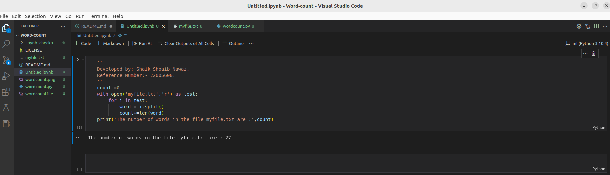

# Word-count
## AIM:
To write a python program for getting the word count from a text.
## EQUIPEMENT'S REQUIRED: 
PC
Anaconda - Python 3.7
## ALGORITHM: 
### Step 1:
Declare a variable count to 0

### Step 2: 
Open the requried text file in read mode as text.(any name can be used).
 
### Step 3: 
Look until variable i in file text.

### Step 4:  
Declare variable word=i.split().

### Step 5: 
Process count+=len(word) and end loop

### Step 6: 
Print the value of count which has the number of words in the file

## PROGRAM:
```
Developed by: Shaik Shoaib Nawaz.
Reference Number: 22005600.

count =0
with open('myfile.txt','r') as test:
    for i in test:
        word = i.split()
        count+=len(word)
print('The number of words in the file myfile.txt are :',count)
```
# File:

# Output:



## RESULT:
Thus the program is written to find the word count from a text.
